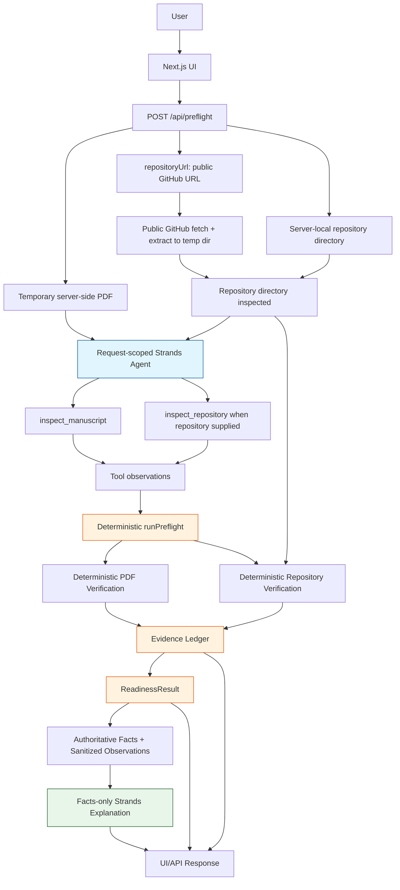

# Proofline Architecture

## Overview

Proofline separates deterministic factual verification from AI explanation using a two-stage Strands architecture.

A **request-scoped orchestration agent** calls verification tools (`inspect_manuscript`, `inspect_repository`) and reasons from observations. The **deterministic `runPreflight()` pipeline** then produces the authoritative readiness state, findings, and Evidence Ledger. Finally, a **facts-only explanation agent** with no verification tools summarizes the result for the user. Neither agent can modify the deterministic result.

## Architecture

## Request-scoped agent loop

- A Strands `Agent` is constructed per-request with tools that **close over server-local paths**.
- The model receives `inspect_manuscript` always, and `inspect_repository` only when a repository directory is supplied.
- Both tools are **zero-argument** from the model's perspective — the PDF path and repository directory are bound in the closure, never exposed as free-form parameters.
- The agent's system prompt forbids inventing verification facts, evidence, or rule identities.
- Its output is a convenience observation trace (`agentInspectionObservation`) passed to the explanation step; it has **no authority** over the readiness result.
- The `inspect_repository` observation exposes the **cross-artifact relationship** to the orchestration agent: its `supplementary_results_artifact` check carries `linkedSubmissionRuleId` (`required_file_supplementary`) and `linkedSubmissionRequirement`, so the agent can see that the repository's `figures/results.pdf` satisfies a manuscript-side requirement.

## Repository verification

- A repository snapshot is built from a **server-local directory** (`inspectLocalRepository`) or from a **public GitHub repository URL**. When `repositoryUrl` is supplied without a local directory, the API validates it against `https://github.com/owner/repo`, resolves the default branch via the public GitHub API, downloads the repository tarball with redirect/host allowlist, size and timeout limits, extracts it into a server temporary directory (path-traversal guarded), and verifies it exactly like a local directory. The temporary directory is deleted after the request. **Local repository directories remain fully supported** and keep their existing semantics: `repositoryDirectory` + `repositoryUrl` supplied together verify the server-local path directly.
- The example repository rule set (`EXAMPLE_REPOSITORY_RULES`, applied once per supplied repository) contains **five rules**: `repository_accessible`, `required_repository_file_readme` (`README.md`), `required_repository_file_license` (`LICENSE`), `required_repository_file_supplementary` (`figures/results.pdf`), and `supplementary_results_artifact_figures_results`.
- `supplementary_results_artifact_figures_results` is the **cross-artifact rule**: it evaluates the repository path `figures/results.pdf` with the same required-file presence semantics as `required_repository_file`, and its `linkedSubmissionRuleId` / `linkedSubmissionRequirement` metadata name the manuscript-side venue rule it satisfies (`required_file_supplementary` — "The submission must include supplementary.pdf."). That metadata is descriptive: it records the relationship and is never used to infer facts.
- The **Evidence Ledger records the relationship**. The cross-artifact evidence entry uses `supplementary_results_artifact_figures_results` as its `ruleId`, reports the observed artifact availability (`present` / `missing` / `unknown`), and its `details` name the linked manuscript-side rule, so the ledger remains traceable without ever deciding rule semantics.
- Every repository check — local or fetched — flows through the same deterministic pipeline (`inspectLocalRepository` → `validateRepositoryRule` → `createEvidenceEntry` → `addEvidenceEntry`), so the added cross-artifact rule does not weaken the deterministic authority described below.

## Deterministic authority

- `runPreflight()` in `lib/preflight/run-preflight.ts` is the **single source of truth** for readiness, findings, and the Evidence Ledger.
- It runs unconditionally after the orchestration agent, using the same inputs (PDF path, optional repository directory/URL).
- Page counts, file presence, rule validation, evidence IDs, and timestamps are all generated by deterministic code — never by the LLM.
- The ReadinessResult (`READY` / `BLOCKED` / `HUMAN REVIEW`) is derived purely from the findings projected from the Evidence Ledger.
- Agent output — from either stage — **cannot alter** readiness, findings, or evidence. The deterministic payload is always returned; agent failure degrades to `agent_unavailable`.

## Security boundary

- Server-local filesystem paths (the temporary PDF upload directory, repository directories) are **never sent to either agent**. They are closed over by request-scoped tools and stripped from the facts serialized to the explanation prompt (`sanitizeFactsForPrompt`).
- The manuscript PDF bytes are **not sent to Groq** — only structured verification results and sanitized observations are.
- The Groq API key is read server-side in `lib/agent/proofline-real-agent.ts`; it is never exposed to the client or logged.

## Public response sanitization

- The internal deterministic result is **never mutated**.
- A public-safe copy of the response is built for the API return value: manuscript `sourceRef` values pointing at the temporary server-side path are replaced with the literal `"manuscript.pdf"`.
- Repository URLs and all other verification facts are preserved unchanged in the public response.
- Server errors return a generic HTTP 500 that never leaks stack traces, environment variables, or filesystem internals.

## Failure behavior

- **Orchestration agent fails**: `agentUnavailable` is set; `runPreflight()` still runs and produces the authoritative result. The explanation step receives only the deterministic facts.
- **Explanation agent fails**: the orchestration observations are used as a fallback explanation if present; otherwise the response is marked `agent_unavailable`.
- **Both agents fail**: the full deterministic result is still returned with `agentStopReason: "agent_unavailable"`.
- **Invalid input**: returns HTTP 400 with a concise error; the temporary PDF is still cleaned up.
- **Unexpected server error**: returns HTTP 500 with a generic message; the temporary PDF is still cleaned up in the `finally` block.
