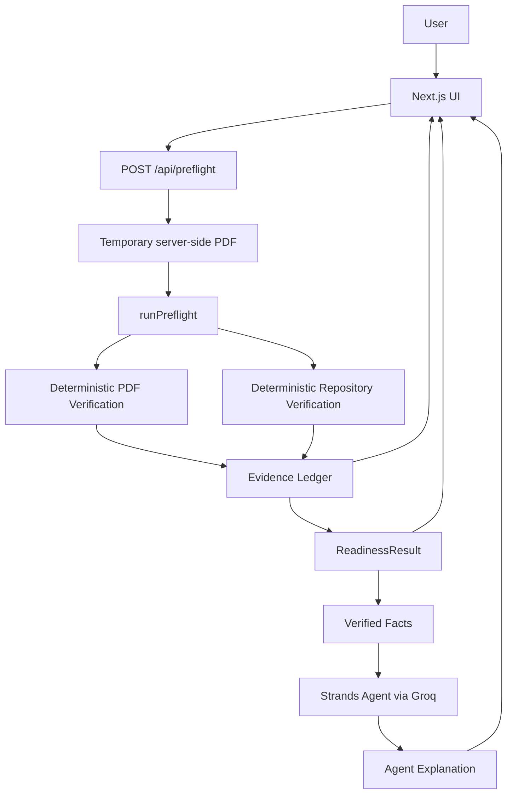

# Proofline Architecture

## Overview

Proofline separates factual verification from AI explanation.

Deterministic application code performs the submission checks and produces the authoritative readiness state and evidence. The Strands agent receives those verified facts and explains them to the user. The agent does not determine or overwrite the verification result.

## Architecture

